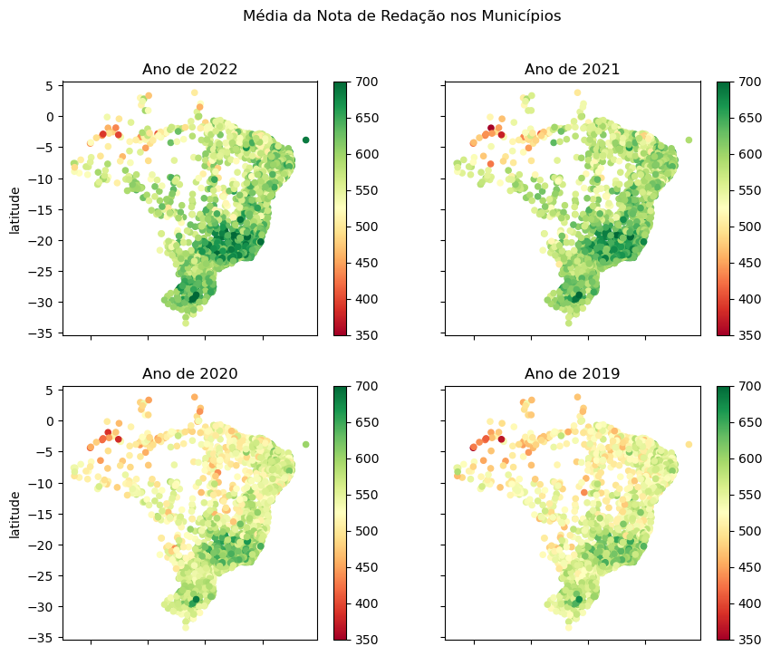
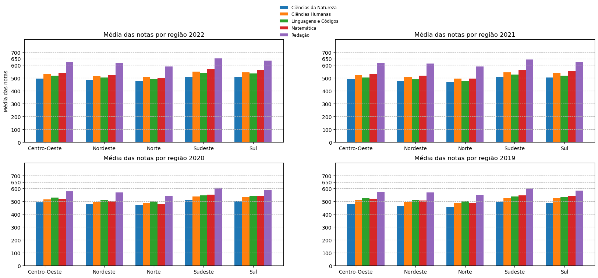

# Microdados-Enem
Uma análise sobre os microdados do enem, vou fazer alguns comparações usando os anos de 2022 a 2019

Vou deixar aqui um link contendo todos os arquivos usando nesse trabalho, não deixei aqui no github por serem
arquivos bem extensos, [Clique aqui para baixar os arquivos](https://drive.google.com/drive/folders/1YvxxxzFYQzfPcf-EluQUSub7Bg7PosM4?usp=sharing)

Aqui vai alguns gráficos que foram feitos nesse trabalho

O primeiro gráfico é um de  dispersão que tem o formato do brasil e mostra a média por municipios

O segundo mostra as médias da nota de cada região do brasil durante os últimos 4 anos (2022 a 2019)

o terceiro mostra uma relação que as notas média tem com relação a ter um computador

